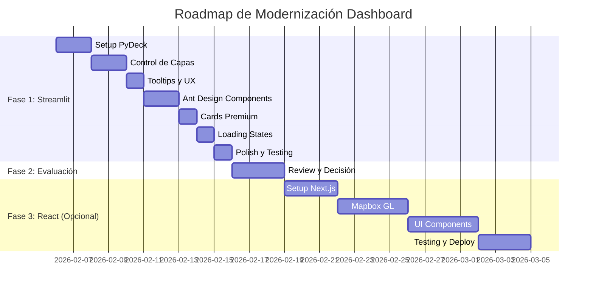

# Roadmap de Implementación - Modernización Dashboard

## 🎯 Resumen de Decisiones

| Aspecto | Recomendación |
|---------|---------------|
| **Opción recomendada** | Fase 1: Streamlit + PyDeck (quick wins) |
| **Alternativa futura** | Fase 2: Evaluar migración React si es necesario |
| **Prioridad** | Mapas avanzados > UI premium > Animaciones |
| **Tiempo estimado** | 1-2 semanas para Fase 1 |

---

## 📋 Roadmap Detallado

### FASE 1: Quick Wins con Streamlit (Prioridad Alta)

#### Semana 1: Mapas Avanzados con PyDeck

**Día 1-2: Setup y Configuración**
```bash
# Nuevas dependencias
pip install pydeck streamlit-antd-components streamlit-lottie
```

- [ ] Crear archivo `dashboard/components/map_pydeck.py`
- [ ] Configurar fuentes de datos GeoJSON
- [ ] Implementar capa base de parroquias coloreadas por cluster
- [ ] Implementar capa de infraestructura petrolera

**Día 3-4: Control de Capas**
- [ ] Crear componente de control de capas en sidebar
- [ ] Implementar toggles de visibilidad
- [ ] Agregar sliders de opacidad
- [ ] Sincronizar estado con `st.session_state`

**Día 5: Tooltips y UX**
- [ ] Configurar tooltips personalizados en PyDeck
- [ ] Agregar información al hover (nombre, cluster, métricas)
- [ ] Implementar click para zoom a parroquia

**Entregable**: Página de mapas completamente renovada con PyDeck

---

#### Semana 2: UI Premium y Animaciones

**Día 1-2: Componentes Ant Design**
- [ ] Instalar `streamlit-antd-components`
- [ ] Reemplazar navegación del sidebar
- [ ] Crear menú con iconos y submenús
- [ ] Implementar tabs para organizar contenido

**Día 3: Cards Premium**
- [ ] Crear módulo `dashboard/components/cards.py`
- [ ] Implementar métricas con gradientes y hover effects
- [ ] Agregar animaciones CSS para transiciones
- [ ] Crear cards de clusters con información detallada

**Día 4: Loading States**
- [ ] Integrar `streamlit-lottie`
- [ ] Crear animaciones de carga personalizadas
- [ ] Implementar skeleton screens
- [ ] Agregar transiciones entre páginas

**Día 5: Polish y Testing**
- [ ] Revisar responsive design
- [ ] Optimizar tiempos de carga (caching)
- [ ] Testing en diferentes navegadores
- [ ] Documentar cambios

**Entregable**: Dashboard con UI modernizada y experiencia mejorada

---

### FASE 2: Evaluación y Decisión (Post-Fase 1)

#### Criterios de Evaluación

Después de completar la Fase 1, evaluar:

| Criterio | ¿Satisfecho? | Notas |
|----------|--------------|-------|
| Mapas con capas múltiples | ⬜ | ¿PyDeck cumple expectativas? |
| Interactividad | ⬜ | ¿Es suficiente el hover/click? |
| Performance | ⬜ | ¿Carga rápido con todos los datos? |
| UX móvil | ⬜ | ¿Funciona bien en tablets/móviles? |
| Feedback usuarios | ⬜ | ¿Qué dicen los stakeholders? |

#### Decisión

**Si la mayoría es SÍ**:
- Continuar con Streamlit
- Agregar más mejoras incrementales
- Considerar componentes custom con `streamlit-components`

**Si la mayoría es NO**:
- Iniciar Fase 3: Migración React
- Priorizar mapas avanzados como motivador principal

---

### FASE 3: Migración React (Opcional)

#### Semana 1-2: Setup y Mapas

- [ ] Inicializar proyecto Next.js
- [ ] Configurar Mapbox GL con capas
- [ ] Crear API endpoints en FastAPI
- [ ] Migrar datos GeoJSON

#### Semana 3-4: UI y Visualizaciones

- [ ] Implementar componentes con Radix UI
- [ ] Crear gráficos con Recharts
- [ ] Agregar animaciones con Framer Motion
- [ ] Sincronizar estado con URL

#### Semana 5: Testing y Deploy

- [ ] Testing completo
- [ ] Optimización de performance
- [ ] Deploy en Vercel + Railway
- [ ] Documentación

---

## 🗓️ Timeline Visual



---

## 📊 Comparativa de Esfuerzo

| Fase | Esfuerzo | Impacto Visual | Riesgo |
|------|----------|----------------|--------|
| Fase 1: Streamlit | Medio | Alto | Bajo |
| Fase 2: Evaluación | Bajo | - | - |
| Fase 3: React | Alto | Muy Alto | Medio |

---

## ✅ Checklist de Decisiones Pendientes

Antes de iniciar, confirmar:

- [ ] **¿Presupuesto para Fase 3?** (React requiere hosting pago ~$25-50/mes)
- [ ] **¿Tiempo disponible?** (Fase 1: 2 semanas, Fase 3: +4 semanas)
- [ ] **¿Necesidad de features avanzados?** (URL compartible, PWA, offline)
- [ ] **¿Audiencia mobile importante?** (Streamlit es limitado en móvil)

---

## 🎁 Entregables por Fase

### Fase 1
1. `dashboard/components/map_pydeck.py` - Mapas avanzados
2. `dashboard/components/cards.py` - Componentes UI premium
3. `dashboard/components/navigation.py` - Navegación Ant Design
4. `dashboard/styles/custom.css` - Animaciones CSS
5. `requirements.txt` actualizado

### Fase 3 (si aplica)
1. Repositorio `frontend/` - Next.js app completa
2. Repositorio `backend/` - FastAPI API
3. Documentación de deployment
4. Tests automatizados

---

## 💡 Recomendación Final

**Comenzar con Fase 1** por las siguientes razones:

1. **Rápido impacto**: En 2 semanas tendrás un dashboard significativamente mejorado
2. **Bajo riesgo**: Si no funciona, no se pierde mucho tiempo
3. **Aprendizaje**: Entenderás mejor qué necesitas para una migración futura
4. **Costo cero**: Todo se puede hostear gratis

**Migrar a React solo si**:
- Los mapas de PyDeck no cumplen expectativas
- Necesitas features avanzadas (URL state, PWA, offline)
- El dashboard es crítico y usado por muchas personas
- Tienes presupuesto para hosting y mantenimiento
